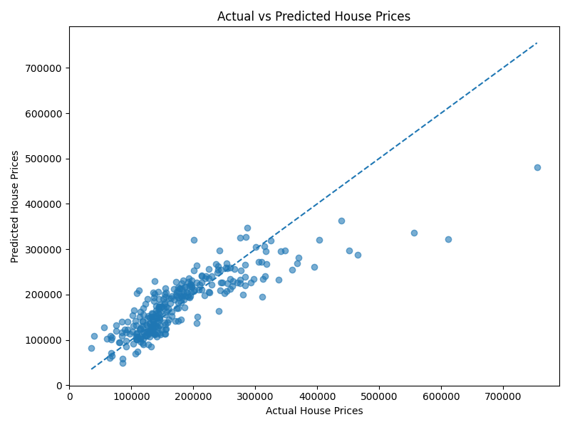

# 🏠 House Price Prediction Model

### Machine Learning & AI Internship — SkillNexis

<p align="center">
  
  
  
  
  
</p>

<p align="center">
  <b>A Machine Learning project that predicts residential house prices using Linear Regression.</b>
</p>

---

## 👨‍💻 Author

**Adhith Raghunathan Nair**

**B.Tech Computer Science & Engineering**  
**Amity University Mumbai**

---

## 🎓 Internship Information

| Field | Details |
|---|---|
| **Internship** | SkillNexis Machine Learning & AI Internship |
| **Project** | Mini Project 2 |
| **Project Title** | House Price Prediction Model |
| **Domain** | Machine Learning |
| **Model Used** | Linear Regression |
| **Dataset** | Kaggle — House Prices Dataset |
| **Programming Language** | Python |

---

## 📌 Project Overview

The **House Price Prediction Model** is a Machine Learning project developed as part of the **SkillNexis Machine Learning & AI Internship**.

The main objective of this project is to build a simple and interpretable **Linear Regression model** capable of predicting residential house prices based on selected property characteristics.

The project follows a complete basic Machine Learning workflow — from loading and exploring the dataset to training the model, generating predictions, evaluating performance, and visualizing the results.

The model uses four selected numerical features:

- 🏠 `GrLivArea` — Above-ground living area
- 🛏️ `BedroomAbvGr` — Number of bedrooms above ground
- 🛁 `FullBath` — Number of full bathrooms
- 📅 `YearBuilt` — Original construction year

The target variable is:

- 💰 `SalePrice` — Final sale price of the house

---

## 🎯 Project Objectives

The project was developed to accomplish the following tasks:

- Load and explore the Kaggle House Prices dataset
- Inspect the structure and dimensions of the dataset
- Identify missing values
- Select relevant numerical features
- Prepare the data for Machine Learning
- Divide the dataset into training and testing sets
- Train a **Linear Regression** model
- Predict house prices using unseen test data
- Evaluate the model using **R² Score**
- Compare actual and predicted house prices visually
- Save prediction results into a CSV file

---

## 📊 Dataset

The project uses the **House Prices — Advanced Regression Techniques** dataset from Kaggle.

The dataset contains information about residential properties along with their corresponding sale prices.

### Dataset Statistics

| Property | Value |
|---|---:|
| **Total Records** | 1,460 |
| **Total Features/Columns** | 81 |
| **Target Variable** | `SalePrice` |
| **Training Samples** | 1,168 |
| **Testing Samples** | 292 |

### Selected Features

| Feature | Description | Type |
|---|---|---|
| `GrLivArea` | Above-ground living area | Numerical |
| `BedroomAbvGr` | Number of bedrooms above ground | Numerical |
| `FullBath` | Number of full bathrooms | Numerical |
| `YearBuilt` | Original construction year | Numerical |

### Target Variable

| Variable | Description |
|---|---|
| `SalePrice` | Final sale price of the residential property |

---

## 🏗️ Project Architecture

The project follows a simple end-to-end Machine Learning pipeline:

```text
                    ┌──────────────────────┐
                    │   Kaggle Dataset     │
                    │      train.csv       │
                    └──────────┬───────────┘
                               │
                               ▼
                    ┌──────────────────────┐
                    │   Data Loading       │
                    │      Pandas          │
                    └──────────┬───────────┘
                               │
                               ▼
                    ┌──────────────────────┐
                    │ Data Exploration     │
                    │ Shape / Missing Data │
                    └──────────┬───────────┘
                               │
                               ▼
                    ┌──────────────────────┐
                    │ Feature Selection     │
                    │                      │
                    │ • GrLivArea          │
                    │ • BedroomAbvGr        │
                    │ • FullBath            │
                    │ • YearBuilt           │
                    └──────────┬───────────┘
                               │
                               ▼
                    ┌──────────────────────┐
                    │ Train-Test Split     │
                    │                      │
                    │ 80% Training        │
                    │ 20% Testing         │
                    └──────────┬───────────┘
                               │
                               ▼
                    ┌──────────────────────┐
                    │ Linear Regression    │
                    │      Model           │
                    └──────────┬───────────┘
                               │
                               ▼
                    ┌──────────────────────┐
                    │ Price Prediction      │
                    │                      │
                    │ Predicted SalePrice  │
                    └──────────┬───────────┘
                               │
                  ┌────────────┴────────────┐
                  ▼                         ▼
       ┌──────────────────┐       ┌────────────────────┐
       │ R² Score         │       │ Actual vs Predicted│
       │ Evaluation       │       │ Visualization      │
       └────────┬─────────┘       └─────────┬──────────┘
                │                           │
                └────────────┬──────────────┘
                             ▼
                  ┌────────────────────────┐
                  │ prediction_results.csv │
                  └────────────────────────┘

# 🧠 Machine Learning Workflow

## 1. Load the Dataset

The Kaggle `train.csv` dataset is loaded using Pandas.

```python
import pandas as pd

data = pd.read_csv("train.csv")
```

The dataset contains:

```text
1,460 rows
81 columns
```

---

## 2. Explore the Dataset

The dataset was inspected using Pandas:

```python
data.head()
data.shape
data.isnull().sum()
```

This helped understand:

* Dataset dimensions
* Available features
* Target variable
* Missing values
* Overall dataset structure

---

## 3. Check Missing Values

The dataset contains missing values in several columns.

The project first checks missing values before selecting the features used by the regression model.

```python
data.isnull().sum()
```

The selected numerical features used for the model were suitable for the implemented workflow.

---

## 4. Feature Selection

Four relevant numerical features were selected:

```python
features = [
    "GrLivArea",
    "BedroomAbvGr",
    "FullBath",
    "YearBuilt"
]
```

These features represent important physical characteristics of a residential property.

---

## 5. Define the Target

The target variable is:

```python
target = "SalePrice"
```

The model learns to estimate:

```text
House Features → SalePrice
```

---

# ✂️ Train-Test Split

The dataset was divided into training and testing data.

```text
Training Data → 80%
Testing Data  → 20%
```

### Actual Split

| Dataset     |   Records |
| ----------- | --------: |
| 🟢 Training |     1,168 |
| 🔵 Testing  |       292 |
| **Total**   | **1,460** |

The training data is used to teach the model, while the testing data is used to evaluate its performance on unseen data.

---

# 🤖 Linear Regression Model

The project uses **Linear Regression**, a supervised Machine Learning algorithm designed for predicting continuous numerical values.

The model attempts to learn a mathematical relationship between the selected house features and the sale price.

Conceptually:

```text
       House Features
             │
             ▼
 ┌──────────────────────┐
 │      Features        │
 │                      │
 │  GrLivArea           │
 │  BedroomAbvGr        │
 │  FullBath            │
 │  YearBuilt           │
 └──────────┬───────────┘
            │
            ▼
 ┌──────────────────────┐
 │  Linear Regression   │
 │       Model          │
 └──────────┬───────────┘
            │
            ▼
 ┌──────────────────────┐
 │ Predicted SalePrice  │
 └──────────────────────┘
```

The model was implemented using Scikit-learn:

```python
from sklearn.linear_model import LinearRegression

model = LinearRegression()

model.fit(X_train, y_train)
```

---

# 💰 House Price Prediction

After training, the model predicts prices for the test dataset.

```python
predictions = model.predict(X_test)
```

Example predictions generated:

```text
123619.10
318334.96
101720.32
170545.57
240375.41
119211.72
195534.10
178012.94
117291.77
150770.20
```

These values represent estimated house selling prices for samples from the testing dataset.

---

# 📈 Model Evaluation

The model was evaluated using the **R² (R-squared) Score**.

### R² Score

```text
0.7062392402008095
```

## ⭐ Final Result

# **R² = 0.7062**

An R² score of approximately **0.7062** indicates that the selected features and Linear Regression model explain a substantial portion of the variation in house sale prices on the test dataset.

Since this implementation intentionally uses only four features, the result serves as a useful baseline for further experimentation and improvement.

---

# 📊 Actual vs Predicted Visualization

The project generates a scatter plot comparing:

* 🔵 Actual house prices
* 🟠 Predicted house prices

The visualization helps evaluate how closely the model's predictions follow the actual sale prices.

The closer the points are to the ideal diagonal relationship, the closer the predictions are to the actual values.

### Visualization



---

# 📋 Prediction Results

The project also exports prediction results into:

```text
prediction_results.csv
```

The file contains the actual and predicted house prices generated during testing.

Example:

| Actual SalePrice | Predicted SalePrice |
| ---------------: | ------------------: |
|           208500 |    Model Prediction |
|           181500 |    Model Prediction |
|           223500 |    Model Prediction |
|           140000 |    Model Prediction |
|           250000 |    Model Prediction |

This makes it easy to inspect individual predictions and compare model output with the original values.

---

# 📁 Project Structure

```text
House-Price-Prediction/
│
├── 📄 house_price_prediction.py
│   └── Main Machine Learning implementation
│
├── 📊 train.csv
│   └── Kaggle House Prices dataset
│
├── 📈 actual_vs_predicted.png
│   └── Actual vs Predicted visualization
│
├── 📋 prediction_results.csv
│   └── Actual and predicted house prices
│
└── 📘 README.md
    └── Project documentation
```

---

# 🛠️ Technologies & Libraries

## 🐍 Programming Language

**Python**

Used for implementing the complete Machine Learning workflow.

## 🐼 Data Processing

**Pandas**

Used for:

* Dataset loading
* Data inspection
* Missing value analysis
* Feature selection
* Data manipulation

## 🤖 Machine Learning

**Scikit-learn**

Used for:

* Train-test splitting
* Linear Regression
* Model training
* Prediction
* R² evaluation

## 📊 Visualization

**Matplotlib**

Used to generate the:

```text
Actual vs Predicted House Prices
```

visualization.

---

# ⚙️ Installation & Setup

## 1️⃣ Clone the Repository

```bash
git clone https://github.com/adhithraghunath006-stack/House-Price-Prediction.git
```

Navigate into the project:

```bash
cd House-Price-Prediction
```

---

## 2️⃣ Install Dependencies

Run:

```bash
pip install pandas numpy matplotlib scikit-learn
```

---

## 3️⃣ Run the Project

Execute:

```bash
python house_price_prediction.py
```

The program will:

```text
✓ Load the dataset
✓ Explore the data
✓ Check missing values
✓ Select relevant features
✓ Split training/testing data
✓ Train Linear Regression
✓ Generate predictions
✓ Calculate R² Score
✓ Generate visualization
✓ Save prediction results
```

---

# 📦 Output Files

After successful execution, the project generates:

### 📈 `actual_vs_predicted.png`

A visualization comparing actual and predicted house prices.

### 📋 `prediction_results.csv`

A CSV file containing prediction results from the trained model.

---

# 📊 Results Summary

| Metric                | Result            |
| --------------------- | ----------------- |
| **Dataset Size**      | 1,460 × 81        |
| **Features Used**     | 4                 |
| **Training Samples**  | 1,168             |
| **Testing Samples**   | 292               |
| **Algorithm**         | Linear Regression |
| **Target Variable**   | SalePrice         |
| **Evaluation Metric** | R² Score          |
| **R² Score**          | **0.7062**        |

---

# 💡 Key Learnings

This project provided practical experience with the fundamental stages of a Machine Learning pipeline.

### Data Handling

* Understanding real-world datasets
* Loading CSV files with Pandas
* Inspecting dataset structure
* Identifying missing values

### Machine Learning

* Feature selection
* Target variable selection
* Train-test splitting
* Supervised learning
* Linear Regression
* Generating predictions

### Model Evaluation

* Understanding R² Score
* Comparing predicted and actual values
* Interpreting model performance

### Data Visualization

* Creating scatter plots
* Visualizing model predictions
* Understanding prediction behaviour

### Project Development

* Organizing an ML project
* Saving generated outputs
* Documenting the workflow
* Using Git and GitHub for version control

---

# 🚀 Future Improvements

The current implementation provides a simple Linear Regression baseline.

The model could be further improved by:

* 🔹 Using additional relevant house features
* 🔹 Applying advanced feature engineering
* 🔹 Encoding categorical variables
* 🔹 Handling missing values more extensively
* 🔹 Detecting and treating outliers
* 🔹 Applying feature scaling where appropriate
* 🔹 Comparing multiple regression algorithms
* 🔹 Implementing Random Forest Regression
* 🔹 Implementing Gradient Boosting
* 🔹 Experimenting with XGBoost
* 🔹 Performing hyperparameter tuning
* 🔹 Applying cross-validation
* 🔹 Optimizing feature selection

These improvements could potentially produce a more accurate and robust house price prediction system.

---

# 🎓 Internship Context

This project was completed as part of the:

## **SkillNexis Machine Learning & AI Internship**

### Mini Project 2 — House Price Prediction Model

The project focuses on applying fundamental Machine Learning concepts to a real-world housing dataset.

It demonstrates the complete journey from:

```text
Raw Dataset
     ↓
Data Exploration
     ↓
Feature Selection
     ↓
Train-Test Split
     ↓
Model Training
     ↓
Prediction
     ↓
Evaluation
     ↓
Visualization
     ↓
Results
```

---

# 🧠 Project Takeaway

This project demonstrates how a Machine Learning regression model can learn relationships between **house characteristics** and **historical selling prices**.

Although the implementation uses a simple **Linear Regression model with four selected features**, it establishes a complete and reproducible Machine Learning pipeline.

The achieved **R² score of 0.7062** provides a strong baseline for experimenting with additional features, feature engineering, and more advanced regression algorithms.

---

# 👨‍💻 About Me

## **Adhith Raghunathan Nair**

🎓 B.Tech Computer Science & Engineering
🏫 Amity University Mumbai

I am a Computer Science student with an interest in building practical technology solutions across:

* 🤖 Artificial Intelligence & Machine Learning
* 🌐 Web Development
* 📊 Data Science
* 💻 Software Development
* 🚀 Emerging Technologies

I enjoy turning ideas into functional projects while continuously exploring new technologies and improving my technical skills.

---

# 🙏 Acknowledgements

Special thanks to:

* 🎓 **SkillNexis** — Machine Learning & AI Internship
* 📊 **Kaggle** — House Prices Dataset
* 🤖 **Scikit-learn** — Machine Learning tools
* 🐼 **Pandas** — Data processing
* 📈 **Matplotlib** — Data visualization

---

# 📜 License

This project was developed for **educational and internship purposes**.

The dataset used in this project is sourced from Kaggle.

---

# ⭐ Repository

If you found this project useful, feel free to explore the repository and review the implementation.

**Built with Python, Machine Learning & curiosity 🚀**

